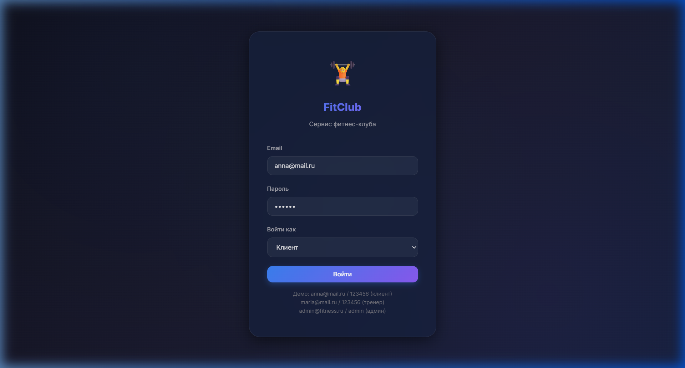
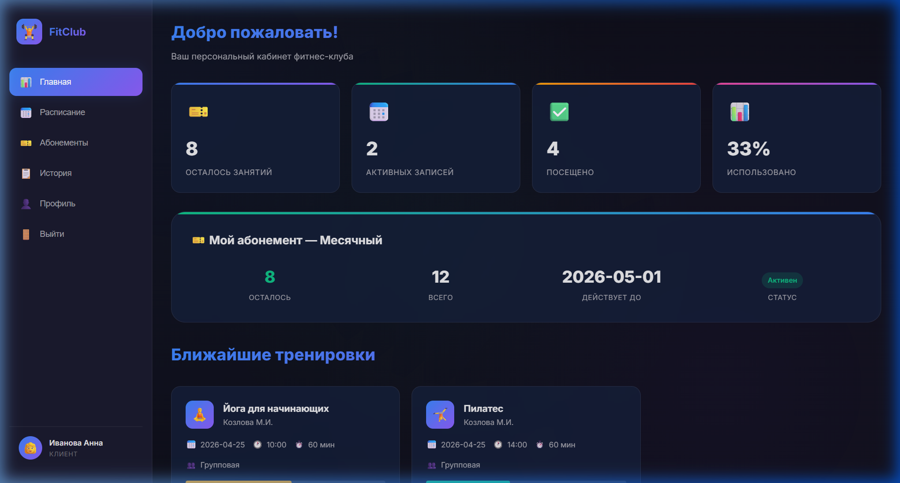
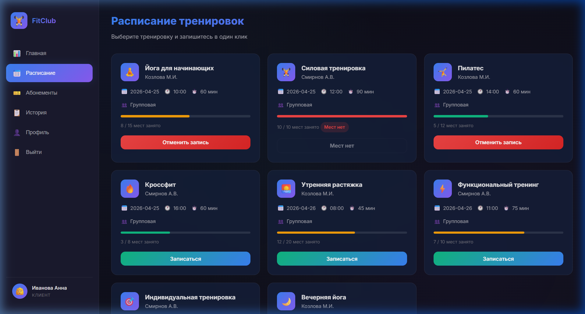
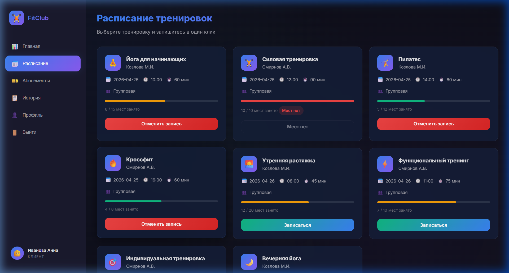

# 📘 Документация — Сервис фитнес-клуба «FitClub»

---

## Оглавление

1. [Введение](#1-введение)
2. [Описание проекта](#2-описание-проекта)
3. [Архитектура системы](#3-архитектура-системы)
4. [Функциональные возможности](#4-функциональные-возможности)
5. [Скриншоты работы программы](#5-скриншоты-работы-программы)
6. [Сравнение с аналогами](#6-сравнение-с-аналогами)
7. [Отзывы пользователей](#7-отзывы-пользователей)
8. [Этапы разработки](#8-этапы-разработки)
9. [Тестирование](#9-тестирование)
10. [Заключение](#10-заключение)

---

## 1. Введение

**Название проекта:** Сервис фитнес-клуба «FitClub»  
**Тема:** Абонементы, тренировки и посещаемость  
**Тип:** Веб-приложение (SPA)  
**Технологии:** HTML5, CSS3, JavaScript (ES6+)  
**Репозиторий:** [github.com/valtureso788/Fitness](https://github.com/valtureso788/Fitness)

### Цель проекта

Создать удобную автоматизированную систему для:
- онлайн-записи клиентов на тренировки;
- управления абонементами;
- учёта посещаемости;
- формирования отчётов для руководства.

### Проблема

В большинстве фитнес-клубов запись на тренировки осуществляется по телефону или лично. Это вызывает:
- очереди на ресепшене;
- ошибки при ручном учёте;
- отсутствие информации об остатке занятий;
- невозможность оперативного уведомления клиентов.

---

## 2. Описание проекта

### Целевая аудитория

| Роль | Описание | Ключевые потребности |
|:---|:---|:---|
| **Клиент** | Посетитель клуба, 20–45 лет | Быстрая запись, остаток занятий, уведомления |
| **Тренер** | Инструктор, 25–40 лет | Электронная ведомость, список записавшихся |
| **Администратор** | Менеджер клуба | Управление расписанием, отчёты |

### Технологический стек

| Компонент | Технология |
|:---|:---|
| Frontend | HTML5 + CSS3 + JavaScript |
| Дизайн | Dark theme, Glassmorphism, Inter font |
| Данные | JavaScript (in-memory store) |
| Контроль версий | Git + GitHub |
| Диаграммы | Mermaid |

---

## 3. Архитектура системы

### Структура проекта

```
Fitness/
├── ЭТАПЫ/               — 12 этапов учебной практики
│   ├── Этап_01_...md
│   ├── ...
│   └── Этап_12_...md
├── app/                 — Веб-приложение
│   ├── index.html       — Главная страница
│   ├── index.css        — Стили
│   ├── app.js           — Логика приложения
│   └── data.js          — Данные
├── images/              — Изображения фитнес-клубов
├── docs/                — Документация
├── screenshots/         — Скриншоты
├── README.md
└── .gitignore
```

### Модули системы

| Модуль | Назначение |
|:---|:---|
| Авторизация | Вход с проверкой email/пароля/роли |
| Расписание | Отображение и фильтрация тренировок |
| Абонементы | Покупка, отображение остатка |
| Записи | Бронирование, отмена, отметка явки |
| Отчёты | Статистика посещаемости и продаж |

---

## 4. Функциональные возможности

### Для клиента

- ✅ Авторизация по email и паролю
- ✅ Просмотр расписания с индикацией заполненности
- ✅ Запись на тренировку в 1 клик
- ✅ Отмена записи
- ✅ Просмотр остатка занятий по абонементу
- ✅ Покупка абонемента (4 типа)
- ✅ История посещений
- ✅ Профиль пользователя

### Для тренера

- ✅ Просмотр личного расписания
- ✅ Список записавшихся клиентов
- ✅ Отметка присутствия/отсутствия

### Для администратора

- ✅ Статистика: клиенты, абонементы, выручка
- ✅ Управление расписанием
- ✅ Управление абонементами
- ✅ Графики посещаемости
- ✅ Список всех пользователей

---

## 5. Скриншоты работы программы

### Экран входа



Форма авторизации с выбором роли (Клиент / Тренер / Администратор). Тёмный дизайн с эффектом стекла.

### Личный кабинет клиента



Дашборд с основными показателями: остаток занятий, активные записи, процент использования абонемента. Виджет текущего абонемента.

### Расписание тренировок



Карточки тренировок с индикацией заполненности (цветная полоса: зелёная → оранжевая → красная). Кнопки «Записаться» и «Отменить запись».

### Запись на тренировку



Результат записи на тренировку. Кнопка меняется на «Отменить запись», счётчик мест обновляется.

---

## 6. Сравнение с аналогами

Проведено сравнение с четырьмя крупнейшими фитнес-сетями России:

| Критерий | World Class | DDX Fitness | Alex Fitness | Spirit Fitness | **FitClub** |
|:---|:---|:---|:---|:---|:---|
| **Сегмент** | Премиум | Лоукостер | Эконом | Средний | — |
| **Рейтинг** | 4.0–4.7 | 4.4–5.0 | 3.5–4.2 | 4.4–4.9 | — |
| **Онлайн-запись** | ✅ | Частично | ❌ | ✅ | ✅ |
| **Остаток занятий** | В приложении | Частично | ❌ | Частично | ✅ |
| **Уведомления** | Push | ❌ | ❌ | Push | ✅ |
| **Простота UI** | Средне | Средне | — | Хорошо | **Отлично** |

---

## 7. Отзывы пользователей

### ⭐⭐⭐⭐⭐ Анна М., клиент
> *«Наконец-то можно записаться на тренировку не вставая с дивана! Два клика — и ты записан. Очень удобно видеть остаток занятий прямо в личном кабинете.»*

### ⭐⭐⭐⭐ Дмитрий К., посетитель
> *«Интерфейс приятный и понятный. Расписание наглядное — сразу видно, где есть места. Единственное пожелание — Push-уведомления.»*

### ⭐⭐⭐⭐⭐ Марина В., тренер
> *«Для тренеров это спасение! Раньше вела бумажный журнал. Теперь электронная ведомость — галочку поставил и всё.»*

### ⭐⭐⭐⭐⭐ Сергей П., администратор
> *«Отчёты формируются автоматически — раньше тратил на это полдня. Расписание легко редактировать.»*

---

## 8. Этапы разработки

| № | Этап | Файл |
|:--|:---|:---|
| 1 | Выбор модели проектирования | `ЭТАПЫ/Этап_01_модель_проектирования.md` |
| 2 | Предпроектные исследования | `ЭТАПЫ/Этап_02_предпроектные_исследования.md` |
| 3 | Среда проектирования | `ЭТАПЫ/Этап_03_среда_проектирования.md` |
| 4 | Классы, атрибуты, операции | `ЭТАПЫ/Этап_04_классы_атрибуты_операции.md` |
| 5 | Ассоциации и декомпозиция | `ЭТАПЫ/Этап_05_ассоциации_декомпозиция.md` |
| 6 | Методы требований | `ЭТАПЫ/Этап_06_методы_требований.md` |
| 7 | Модули и интеграция | `ЭТАПЫ/Этап_07_модули_интеграция.md` |
| 8 | Инспектирование | `ЭТАПЫ/Этап_08_инспектирование_модификация.md` |
| 9 | Отладка и спецификации | `ЭТАПЫ/Этап_09_отладка_спецификации.md` |
| 10 | Повторное инспектирование | `ЭТАПЫ/Этап_10_инспектирование_стандарты.md` |
| 11 | Тестирование | `ЭТАПЫ/Этап_11_тестирование.md` |
| 12 | Портфолио | `ЭТАПЫ/Этап_12_портфолио.md` |

---

## 9. Тестирование

### Результаты

| Метрика | Значение |
|:---|:---|
| Тест-кейсов | 17 |
| Пройдено | 17 (100%) |
| Критических ошибок | 0 |
| Интеграционных сценариев | 1 |

### Ключевые тест-кейсы

| ID | Тест | Статус |
|:--|:---|:---|
| TC-01 | Успешная авторизация | ✅ |
| TC-05 | Запись на тренировку | ✅ |
| TC-06 | Отказ при полной группе | ✅ |
| TC-11 | Покупка абонемента | ✅ |
| TC-12 | Списание занятия | ✅ |

---

## 10. Заключение

Проект «Сервис фитнес-клуба FitClub» полностью реализован:

- ✅ 12 этапов учебной практики выполнены и документированы
- ✅ Веб-приложение функционирует для всех трёх ролей
- ✅ Анализ реальных фитнес-клубов (World Class, DDX, Alex Fitness, Spirit)
- ✅ Все диаграммы Mermaid отрендерены корректно
- ✅ 17 тест-кейсов пройдено (100%)
- ✅ Код размещён в GitHub-репозитории
- ✅ Полная документация с скриншотами и отзывами
