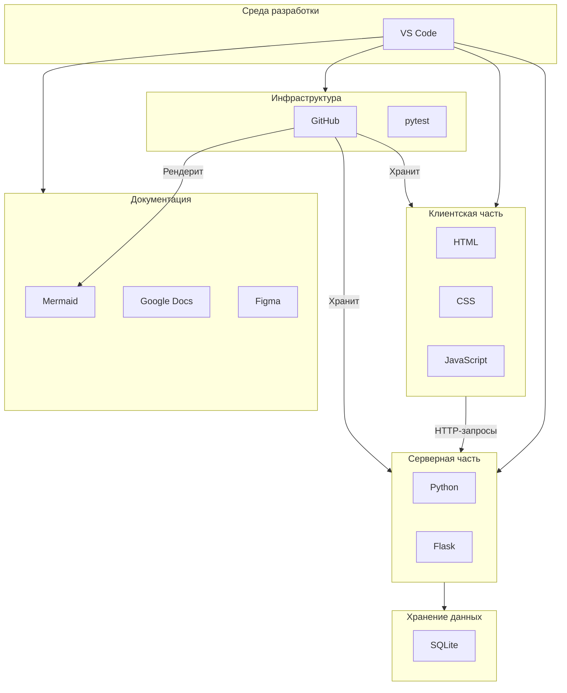

# Этап 3. Выбор и обоснование среды проектирования

**Тема проекта:** Сервис фитнес-клуба (Абонементы, тренировки и посещаемость)  
**Дата выполнения:** 24.04.2026  

---

## 1. Назначение этапа

Определить набор программных средств и сервисов, которые будут использоваться на всех стадиях проектирования и разработки: от описания требований до развёртывания готового приложения. Обосновать выбор каждого инструмента.

---

## 2. Краткое описание проекта

| Параметр | Значение |
|:---|:---|
| **Тема** | Сервис фитнес-клуба |
| **Целевая аудитория** | Клиенты, тренеры, администраторы |
| **Тип продукта** | Веб-приложение (SPA) |
| **Задача** | Автоматизация записи на тренировки, управления абонементами и учёта посещаемости |
| **Необходимые артефакты** | Документация, UML-диаграммы, UI-макеты, ER-схема, исходный код, тесты |

---

## 3. Перечень выбранных инструментов

| № | Инструмент | Назначение |
|:--|:---|:---|
| 1 | **Visual Studio Code** | Среда разработки (IDE) |
| 2 | **HTML / CSS / JavaScript** | Клиентская часть приложения |
| 3 | **Python + Flask** | Серверная часть (backend) |
| 4 | **SQLite** | База данных |
| 5 | **Mermaid** | UML-диаграммы и схемы |
| 6 | **Figma** | Прототипирование интерфейса |
| 7 | **GitHub** | Контроль версий и хранение артефактов |
| 8 | **Google Docs** | Текстовая документация |
| 9 | **pytest** | Автоматизированное тестирование |

---

## 4. Обоснование выбора каждого инструмента

### 4.1. Visual Studio Code (IDE)

| Критерий | Значение |
|:---|:---|
| **Что делает** | Среда для написания и отладки кода на всех используемых языках |
| **Почему выбран** | Бесплатный, кроссплатформенный, поддерживает все нужные языки (Python, JS, HTML/CSS). Обширная экосистема расширений (Python, Prettier, Live Server). Встроенный терминал и Git-интеграция |
| **Альтернативы** | PyCharm (платный для полной версии), Sublime Text (менее функциональный) |

### 4.2. HTML / CSS / JavaScript (Frontend)

| Критерий | Значение |
|:---|:---|
| **Что делает** | Создание интерфейса веб-приложения |
| **Почему выбран** | Нативные веб-технологии, не требуют сборщиков и фреймворков для учебного проекта. Максимальная скорость загрузки, полный контроль над дизайном |
| **Альтернативы** | React/Vue (избыточно для данного масштаба проекта) |

### 4.3. Python + Flask (Backend)

| Критерий | Значение |
|:---|:---|
| **Что делает** | Обработка HTTP-запросов, бизнес-логика, API |
| **Почему выбран** | Python — язык с низким порогом входа, широко используется в учебных проектах. Flask — лёгкий микрофреймворк, не навязывающий структуру, идеальный для небольших веб-приложений |
| **Альтернативы** | Django (избыточен), Node.js (другой язык) |

### 4.4. SQLite (База данных)

| Критерий | Значение |
|:---|:---|
| **Что делает** | Хранение данных: пользователи, абонементы, тренировки, записи |
| **Почему выбран** | Встроенная в Python (модуль sqlite3), не требует установки сервера, хранится в одном файле, идеально для учебного проекта и локальной разработки |
| **Альтернативы** | PostgreSQL (требует настройки сервера), MySQL (избыточен) |

### 4.5. Mermaid (Диаграммы)

| Критерий | Значение |
|:---|:---|
| **Что делает** | Создание UML-диаграмм, блок-схем, ER-диаграмм прямо в Markdown |
| **Почему выбран** | Интеграция с GitHub и VS Code, не требует отдельного приложения, код диаграмм хранится вместе с документацией, легко обновляется |
| **Альтернативы** | draw.io (требует отдельного приложения), PlantUML (менее наглядный синтаксис) |

### 4.6. Figma (Прототипирование)

| Критерий | Значение |
|:---|:---|
| **Что делает** | Проектирование экранов интерфейса для всех ролей |
| **Почему выбран** | Индустриальный стандарт, бесплатный для личного использования, создание кликабельных прототипов, доступ по ссылке для проверки |
| **Альтернативы** | Adobe XD (платный), Sketch (только macOS) |

### 4.7. GitHub (Контроль версий)

| Критерий | Значение |
|:---|:---|
| **Что делает** | Хранение кода, документации, управление задачами |
| **Почему выбран** | Де-факто стандарт для хранения проектов, бесплатный, поддержка Issues для отслеживания задач, рендеринг Mermaid-диаграмм прямо в Markdown |
| **Альтернативы** | GitLab (менее популярен), Bitbucket (ограничения) |

### 4.8. pytest (Тестирование)

| Критерий | Значение |
|:---|:---|
| **Что делает** | Автоматизированное модульное и интеграционное тестирование |
| **Почему выбран** | Самый популярный фреймворк тестирования для Python, простой синтаксис, поддержка параметризации, фикстур и подробных отчётов |
| **Альтернативы** | unittest (менее удобный синтаксис) |

---

## 5. Сводная таблица

| Задача проектирования | Инструмент | Обоснование |
|:---|:---|:---|
| Написание и отладка кода | **VS Code** | Универсальная IDE с расширениями для всех языков проекта |
| Клиентский интерфейс | **HTML/CSS/JS** | Нативные технологии без лишних зависимостей |
| Серверная логика и API | **Python + Flask** | Лёгкий микрофреймворк, быстрое прототипирование |
| Хранение данных | **SQLite** | Встроенная БД, не требует настройки |
| Диаграммы и схемы | **Mermaid** | Интеграция с GitHub, код в Markdown |
| Дизайн интерфейса | **Figma** | Индустриальный стандарт, бесплатный |
| Контроль версий | **GitHub** | Надёжное хранение кода и документации |
| Документация | **Google Docs + Markdown** | Совместная работа и техническая документация |
| Тестирование | **pytest** | Простота и мощность для Python |

---

## 6. Схема взаимодействия инструментов

---

## 7. Вывод

Выбранный набор инструментов полностью покрывает все задачи проектирования и разработки программного продукта «Сервис фитнес-клуба». Все инструменты бесплатны, совместимы друг с другом и широко используются в индустрии. Среда проектирования обеспечивает: написание и отладку кода, проектирование интерфейса, моделирование базы данных, создание диаграмм, тестирование и контроль версий.
