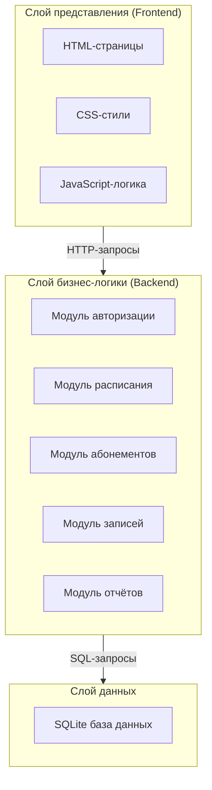
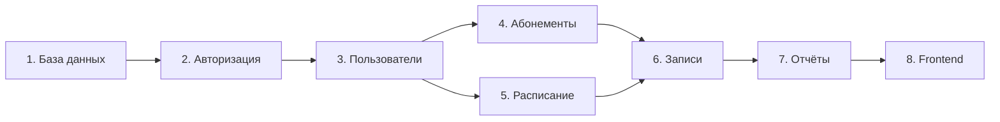
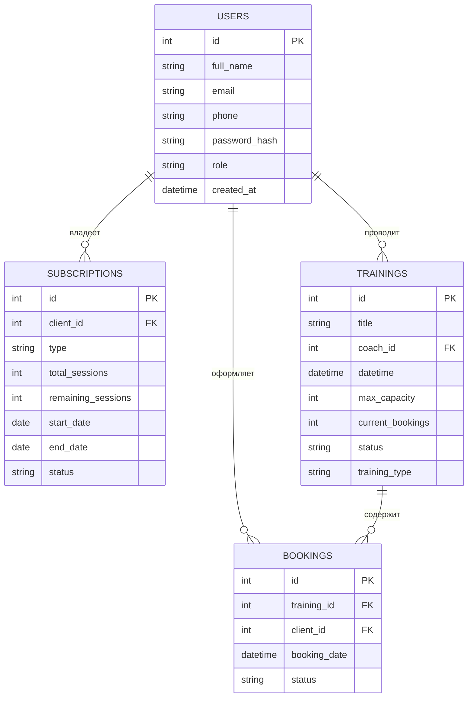

# Этап 7. Разработка модулей и интеграция

**Тема проекта:** Сервис фитнес-клуба (Абонементы, тренировки и посещаемость)  
**Дата выполнения:** 24.04.2026  

---

## 1. Назначение этапа

Определить состав модулей системы, описать их назначение и взаимосвязи, выбрать подход к интеграции.

---

## 2. Архитектура приложения

Система реализована по трёхслойной архитектуре:

---

## 3. Перечень модулей

| № | Модуль | Файл/Компонент | Назначение |
|:--|:---|:---|:---|
| 1 | Авторизация | `auth.py` | Регистрация, вход, выход, управление сессиями |
| 2 | Пользователи | `users.py` | CRUD-операции над профилями, роли |
| 3 | Абонементы | `subscriptions.py` | Покупка, активация, заморозка, проверка валидности |
| 4 | Расписание | `schedule.py` | Создание, редактирование, отмена тренировок |
| 5 | Записи | `bookings.py` | Бронирование, отмена, отметка посещаемости |
| 6 | Отчёты | `reports.py` | Статистика посещаемости и продаж |
| 7 | База данных | `database.py` | Инициализация и миграции БД |
| 8 | Frontend | `app/` | Пользовательский интерфейс (SPA) |

---

## 4. Подход к интеграции

**Выбранный подход:** Инкрементальная интеграция «снизу вверх» (Bottom-Up).

| Характеристика | Описание |
|:---|:---|
| **Суть** | Сначала разрабатываются и тестируются базовые модули (БД, авторизация), затем над ними надстраиваются модули бизнес-логики |
| **Порядок** | database → auth → users → subscriptions → schedule → bookings → reports → frontend |
| **Преимущество** | Каждый модуль можно проверить автономно перед подключением к остальным |

### Порядок интеграции

---

## 5. Описание связей между модулями

| Модуль A | Модуль B | Тип связи | Описание |
|:---|:---|:---|:---|
| database | Все модули | Зависимость | Все модули используют БД для хранения данных |
| auth | users | Зависимость | Авторизация создаёт и проверяет пользователей |
| users | subscriptions | Ассоциация | Абонемент привязан к пользователю |
| users | schedule | Ассоциация | Тренер привязан к тренировке |
| subscriptions | bookings | Зависимость | Запись списывает занятие с абонемента |
| schedule | bookings | Зависимость | Запись ссылается на конкретную тренировку |
| bookings | reports | Зависимость | Отчёты формируются на основе записей |

---

## 6. Структура базы данных (ER-диаграмма)

---

## 7. Вывод

Система разделена на 8 модулей с чёткими зонами ответственности. Выбран подход «снизу вверх» для последовательной интеграции. ER-диаграмма определяет структуру хранения данных.
