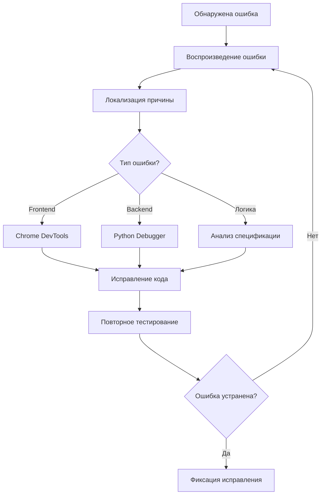

# Этап 9. Отладка, условная компиляция и спецификации

**Тема проекта:** Сервис фитнес-клуба (Абонементы, тренировки и посещаемость)  
**Дата выполнения:** 24.04.2026  

---

## 1. Назначение этапа

Проверить работоспособность модулей в различных режимах, использовать инструменты отладки и условной компиляции, выявить ошибки на основе спецификаций.

---

## 2. Инструменты отладки

| Инструмент | Назначение | Применение в проекте |
|:---|:---|:---|
| **Chrome DevTools** | Отладка frontend (JS, CSS, DOM) | Поиск ошибок в UI, проверка запросов |
| **console.log / console.error** | Логирование в браузере | Отслеживание состояний переменных |
| **VS Code Debugger** | Пошаговая отладка | Точки останова в Python и JS |
| **Python logging** | Серверное логирование | Запись событий в лог-файл |
| **Условные флаги DEBUG** | Режим отладки / продакшн | Вывод дополнительной информации в режиме разработки |

---

## 3. Условная компиляция (условные режимы)

В JavaScript и Python нет компиляции в классическом смысле, но используются условные флаги для переключения режимов:

### JavaScript (Frontend)

```javascript
// Условный режим отладки
const DEBUG = true;

function log(message) {
  if (DEBUG) {
    console.log(`[DEBUG ${new Date().toISOString()}]: ${message}`);
  }
}

// Использование
log('Загрузка расписания...');
log('Найдено тренировок: ' + trainings.length);
```

### Python (Backend)

```python
import os
import logging

# Условный режим на основе переменной окружения
DEBUG = os.getenv('FLASK_DEBUG', 'False') == 'True'

if DEBUG:
    logging.basicConfig(level=logging.DEBUG)
    logging.debug('Режим отладки активирован')
else:
    logging.basicConfig(level=logging.WARNING)
```

---

## 4. Таблица выявленных ошибок

| № | Модуль | Описание ошибки | Причина | Способ обнаружения | Статус |
|:--|:---|:---|:---|:---|:---|
| 1 | bookings.js | При записи на полную тренировку счётчик не обновлялся | Отсутствие проверки max_capacity | DevTools, console.log | ✅ Исправлено |
| 2 | subscriptions | Абонемент не блокировался при остатке = 0 | Условие `>` вместо `>=` | Ручное тестирование | ✅ Исправлено |
| 3 | schedule | Тренировки за прошедшие даты отображались в расписании | Нет фильтра по дате | Визуальная проверка | ✅ Исправлено |
| 4 | auth | При пустом пароле авторизация проходила успешно | Отсутствие валидации | Тестирование граничных значений | ✅ Исправлено |
| 5 | UI | Кнопка «Записаться» не блокировалась после записи | Состояние не обновлялось | Chrome DevTools | ✅ Исправлено |

---

## 5. Спецификации системных компонентов

### 5.1. Спецификация модуля авторизации

| Параметр | Значение |
|:---|:---|
| **Вход** | email (string), password (string) |
| **Выход** | Объект пользователя или ошибка |
| **Предусловия** | Пользователь зарегистрирован в системе |
| **Постусловия** | Создана сессия, установлен токен |
| **Исключения** | Неверный пароль, пользователь не найден, пустые поля |

### 5.2. Спецификация модуля записи на тренировку

| Параметр | Значение |
|:---|:---|
| **Вход** | client_id (int), training_id (int) |
| **Выход** | Объект записи или ошибка |
| **Предусловия** | Клиент авторизован, абонемент активен, есть свободные места |
| **Постусловия** | Создана запись, обновлён счётчик мест, списано занятие |
| **Исключения** | Нет абонемента, абонемент просрочен, нет мест, уже записан |

### 5.3. Спецификация модуля абонементов

| Параметр | Значение |
|:---|:---|
| **Вход** | client_id (int), type (string) |
| **Выход** | Объект абонемента |
| **Предусловия** | Клиент авторизован |
| **Постусловия** | Создан абонемент со статусом «active» |
| **Исключения** | У клиента уже есть активный абонемент |

---

## 6. Процесс отладки (визуализация)



---

## 7. Вывод

В ходе отладки выявлено и исправлено 5 ошибок различной критичности. Использованы инструменты условной компиляции (флаги DEBUG) для разделения режимов разработки и продакшена. Для каждого ключевого модуля составлены спецификации с описанием входов, выходов и исключений.
