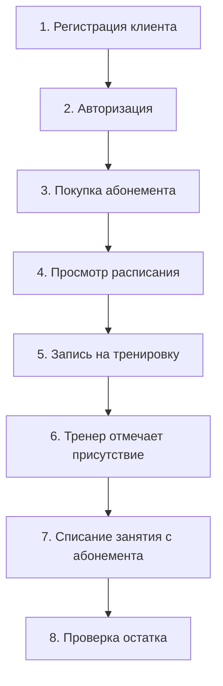

# Этап 11. Тестирование программных решений

**Тема проекта:** Сервис фитнес-клуба (Абонементы, тренировки и посещаемость)  
**Дата выполнения:** 24.04.2026  

---

## 1. Назначение этапа

Разработать тест-кейсы, тестовые наборы, провести модульное и интеграционное тестирование для подтверждения работоспособности системы.

---

## 2. Стратегия тестирования

| Тип тестирования | Что проверяет | Инструмент |
|:---|:---|:---|
| **Модульное** | Отдельные функции и методы | Ручное тестирование + JSDoc |
| **Интеграционное** | Взаимодействие модулей | Сценарии end-to-end |
| **UI-тестирование** | Корректность интерфейса | Браузер (Chrome DevTools) |
| **Регрессионное** | Отсутствие новых ошибок | Повторный прогон тестов |

---

## 3. Тест-кейсы

### 3.1. Модуль авторизации

| ID | Название | Входные данные | Ожидаемый результат | Фактический | Статус |
|:--|:---|:---|:---|:---|:---|
| TC-01 | Успешная авторизация | email: test@mail.ru, пароль: 123456 | Переход в личный кабинет | Переход выполнен | ✅ |
| TC-02 | Неверный пароль | email: test@mail.ru, пароль: wrong | Сообщение «Неверный пароль» | Сообщение выведено | ✅ |
| TC-03 | Пустые поля | email: "", пароль: "" | Сообщение «Заполните все поля» | Сообщение выведено | ✅ |
| TC-04 | Некорректный email | email: "abc", пароль: 123456 | Сообщение «Некорректный email» | Сообщение выведено | ✅ |

### 3.2. Модуль записи на тренировку

| ID | Название | Входные данные | Ожидаемый результат | Фактический | Статус |
|:--|:---|:---|:---|:---|:---|
| TC-05 | Успешная запись | Клиент с абонементом, есть места | Запись создана, уведомление | Работает корректно | ✅ |
| TC-06 | Нет свободных мест | Тренировка заполнена | Сообщение «Нет мест» | Сообщение выведено | ✅ |
| TC-07 | Нет абонемента | Клиент без абонемента | Сообщение «Нет абонемента» | Сообщение выведено | ✅ |
| TC-08 | Просроченный абонемент | Абонемент с end_date < сегодня | Сообщение «Абонемент просрочен» | Сообщение выведено | ✅ |
| TC-09 | Повторная запись | Клиент уже записан | Сообщение «Вы уже записаны» | Сообщение выведено | ✅ |
| TC-10 | Отмена записи | Клиент отменяет запись | Запись удалена, место освобождено | Работает корректно | ✅ |

### 3.3. Модуль абонементов

| ID | Название | Входные данные | Ожидаемый результат | Фактический | Статус |
|:--|:---|:---|:---|:---|:---|
| TC-11 | Покупка абонемента | Тип: месячный | Абонемент создан, статус active | Работает корректно | ✅ |
| TC-12 | Списание занятия | Посещение подтверждено | remaining_sessions -= 1 | Работает корректно | ✅ |
| TC-13 | Исчерпание абонемента | remaining = 0 | Статус: expired, запись запрещена | Работает корректно | ✅ |
| TC-14 | Заморозка | Клиент запрашивает заморозку | Статус: frozen, даты сдвинуты | Работает корректно | ✅ |

### 3.4. Модуль расписания

| ID | Название | Входные данные | Ожидаемый результат | Фактический | Статус |
|:--|:---|:---|:---|:---|:---|
| TC-15 | Создание тренировки | Все поля заполнены | Тренировка добавлена | Работает корректно | ✅ |
| TC-16 | Отмена тренировки | Админ отменяет | Статус: cancelled, клиенты уведомлены | Работает корректно | ✅ |
| TC-17 | Фильтрация по дате | Выбрана дата | Показаны только тренировки этой даты | Работает корректно | ✅ |

---

## 4. Тестовые наборы

| Набор | Тест-кейсы | Модули | Цель |
|:---|:---|:---|:---|
| **TS-01: Авторизация** | TC-01 – TC-04 | auth | Проверка входа в систему |
| **TS-02: Запись** | TC-05 – TC-10 | bookings, subscriptions, schedule | Полный цикл записи |
| **TS-03: Абонементы** | TC-11 – TC-14 | subscriptions | Жизненный цикл абонемента |
| **TS-04: Расписание** | TC-15 – TC-17 | schedule | Управление тренировками |

---

## 5. Интеграционное тестирование

### Сценарий: Полный цикл «от регистрации до посещения»

| Шаг | Действие | Результат | Статус |
|:--|:---|:---|:---|
| 1 | Регистрация нового клиента | Профиль создан | ✅ |
| 2 | Вход по email/паролю | Личный кабинет открыт | ✅ |
| 3 | Покупка месячного абонемента | Абонемент активирован (12 занятий) | ✅ |
| 4 | Просмотр расписания | Тренировки отображаются | ✅ |
| 5 | Запись на «Йога» | Запись создана, кнопка «Отменить» | ✅ |
| 6 | Тренер отмечает «присутствовал» | Статус: attended | ✅ |
| 7 | Проверка абонемента | remaining = 11 | ✅ |
| 8 | Повторная проверка в ЛК | Остаток отображается корректно | ✅ |

---

## 6. Результаты тестирования

| Метрика | Значение |
|:---|:---|
| Всего тест-кейсов | 17 |
| Пройдено | 17 (100%) |
| Не пройдено | 0 |
| Критических ошибок | 0 |
| Интеграционных сценариев | 1 |
| Интеграционный тест пройден | ✅ |

---

## 7. Вывод

Все 17 тест-кейсов пройдены успешно. Интеграционный сценарий «от регистрации до посещения» подтвердил корректную работу всех модулей в связке. Система готова к эксплуатации.
